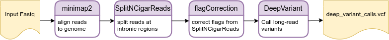

# lrRNAseqVariantCalling


This repository contains all the code used for the analyses in the manuscript *Transformation of alignment files improves the performance of variant callers for long-read RNA sequencing data* ([paper link](https://genomebiology.biomedcentral.com/articles/10.1186/s13059-023-02923-y)). The order in which the scripts were run is indicated by numbers in their names or folders.

Here, we also make the `flagCorrection` tool available, a tool developed by us to manipulate BAM files output by GATK's `SplitNCigarReads` function to make them adequate for deep learning-based variant callers.

In the manuscript, we present a pipeline to increase the performance of the variant callers `DeepVariant` and `Clair3` on long-read RNA-seq (e.g., Iso-Seq data). This pipeline consists of using `minimap2` (to align reads to a reference genome), `SplitNCigarReads` (to split reads at intronic regions), `flagCorrection`, and a variant caller (we suggest `DeepVariant` or `Clair3`). The generic code for this pipeline is shown below.


## Tools required to be installed

Our pipeline required the following tools to be installed:
* `minimap2` (>= 2.17-r941), [see installation](https://github.com/lh3/minimap2);
* `samtools` (>= 1.9), [see installation](https://github.com/samtools/samtools);
* `GATK` (>= v4.1.9.0), [see installation](https://github.com/broadinstitute/gatk/releases);
* `R` (>= 4.0.5), [see installation](https://www.r-project.org/);
* a variant caller, we recomend `DeepVariant` (>= 1.1.0), [see installation](https://github.com/google/deepvariant/blob/r1.3/docs/deepvariant-quick-start.md) &mdash; we run it with [Singularity](https://github.com/apptainer/singularity/blob/master/INSTALL.md), but other option may work,
* or, alternatively, `Clair3` (>= v0.1-r5) [see installation](https://github.com/HKU-BAL/Clair3) &mdash; we run it with [Bioconda](https://bioconda.github.io/user/install.html), but other options may work;
* `vcftools` (>= 0.1.16), [see installation](https://vcftools.github.io/examples.html);
* `bcftools` (>= 1.9), [see installation](http://samtools.github.io/bcftools/), or [install bcftools with Bioconda](https://anaconda.org/bioconda/bcftools);
* `tabix` (>= 1.10.2), [install tabix with Bioconda](https://anaconda.org/bioconda/tabix) or `sudo apt update ; sudo apt install tabix`;
* the `R` packages:
  * Rsamtools (>= 2.4.0),
  * foreach (>= 1.5.0), and
  * doParallel (>= 1.0.15).

To install the `R` packages, run `R` and enter the following code:

```R
if (!requireNamespace("BiocManager", quietly = TRUE))
    install.packages("BiocManager")
BiocManager::install(c("foreach", "doParallel", "Rsamtools"))
```


## How to installing flagCorrection and parameter description

To install `flagCorrection`, simply clone this repository with the command

```
git clone https://github.com/vladimirsouza/lrRNAseqVariantCalling.git
```

To run `flagCorrection`, use a command that looks like

```
Rscript ${PATH_TO_REPO}/flagCorrection.r \
  ${INPUT_ORIGINAL_BAM} \
  ${INPUT_SPLIT_BAM} \
  ${OUTPUT_BAM} \
  ${THREADS}
```

where the variables
* `PATH_TO_REPO`, is the path to your cloned **lrRNAseqVariantCalling** repository;
* `INPUT_ORIGINAL_BAM`, is the path to the original BAM file (reads not split);
* `INPUT_SPLIT_BAM`, is the path to the BAM file that stores split reads (originated from `INPUT_ORIGINAL_BAM` after using `SplitNCigarReads`);
* `OUTPUT_BAM`, is the path to the output BAM file to be written (stores split reads with corrected flags);
* `THREADS`, is the number of threads to use.


## How to call genetic variants from Iso-Seq data using our pipeline



To illustrate how to call variants from Iso-Seq data using our pipeline, we use as input a small public Iso-Seq BAM that contains full-length non-concatemer reads, which can be downloaded [here](https://downloads.pacbcloud.com/public/dataset/ISMB_workshop/isoseq3/results/alz.flnc.bam).

We also need a reference genome (download [here](https://downloads.pacbcloud.com/public/dataset/ISMB_workshop/hg38.fa)).

Convert the Iso-Seq BAM to FASTQ format.

```
bamToFastq \
  -i ${ISOSEQ_BAM} \
  -fq ${ISOSEQ_FASTQ}
```

Align the Iso-Seq reads to the genome, and sort and index the alignments.

```
### align reads to the genome of reference and remove secondary and
### supplementary alignments; keep duplicates
minimap2 -ax splice \
  -uf -C5 \
  -t ${THREADS} \
  --secondary=no \
  ${REF_FASTA} \
  ${ISOSEQ_FASTQ} \
  | samtools view -bSh -F 2308 - \
  > ${OUTPUT_DIR}/aln.bam

### sort and index
samtools sort \
  -@ ${THREADS} \
  -o ${OUTPUT_DIR}/aln_s.bam \
  ${OUTPUT_DIR}/aln.bam
rm ${OUTPUT_DIR}/aln.bam

samtools index \
  -@ $THREADS \
  ${OUTPUT_DIR}/aln_s.bam
```

We use `GATK`'s `SplitNCigarReads` function to split reads at intronic regions, *i.e.*, at Ns of their CIGAR string. This removes introns from the alignments.

```
### need to create a sequence dictionary for a reference FASTA
gatk CreateSequenceDictionary -R ${REF_FASTA}

### SplitNCigarReads
gatk --java-options "-Xmx4G -XX:+UseParallelGC -XX:ParallelGCThreads=${THREADS}" SplitNCigarReads \
  -R ${REF_FASTA} \
  -I ${OUTPUT_DIR}/aln_s.bam \
  -O ${OUTPUT_DIR}/aln_sncr.bam
```

After splitting the reads, most of them receive a supplementary flag. We need to correct these flags with `flagCorrection`. 

```
### flagCorrection
 Rscript ${PATH_TO_REPO}/flagCorrection.r \
  ${OUTPUT_DIR}/aln_s.bam \
  ${OUTPUT_DIR}/aln_sncr.bam \
  ${OUTPUT_DIR}/aln_sncr_fc.bam \
  ${THREADS}

### index
samtools index \
  -@ ${THREADS} \
  ${OUTPUT_DIR}/aln_sncr_fc.bam
```

Now variants can be called with high performance using `DeepVariant`. The command is the same that is used normally to call variants from DNA sequences.

```
mkdir ${OUTPUT_DIR}/deepvariant

singularity exec --bind ${OUTPUT_DIR}/deepvariant,/usr/lib/locale/ \
  /home/vbarbo/programs/deepvariant_singularity/deepvariant-1.1.0.simg \
  /opt/deepvariant/bin/run_deepvariant \
  --model_type PACBIO \
  --ref ${REF_FASTA} \
  --reads ${OUTPUT_DIR}/aln_sncr_fc.bam \
  --output_vcf ${OUTPUT_DIR}/deepvariant/deepvariant_calls.vcf \
  --num_shards ${THREADS}
```

`${OUTPUT_DIR}/deepvariant/deepvariant_calls.vcf` contains the variants called by `DeepVariant`.


### Alternative for variant calling from Iso-Seq with Clair3

To call variants from Iso-Seq with `Clair3`, we recommend using our pipeline only to call indels, and `Clair3` normally for SNPs, a pipeline that we call **Clair3-mix** in the manuscript. 

Indel calling:

```
mkdir -p ${OUTPUT_DIR}/clair3/indel

### run Clair3
conda activate clair3

${PATH_TO_CLAIR3_DIR}/run_clair3.sh \
  --bam_fn=${OUTPUT_DIR}/aln_sncr_fc.bam \
  --ref_fn=${REF_FASTA} \
  --threads=${THREADS} \
  --platform="hifi" \
  --model_path=${PATH_TO_CLAIR3_HIFI_MODEL} \
  --output=${OUTPUT_DIR}/clair3/indel

### take only indels
### we use pileup.vcf.gz instead of merge_output.vcf.gz, since the 
### full-alignment model does not work with Iso-Seq data
vcftools --gzvcf ${OUTPUT_DIR}/clair3/indel/pileup.vcf.gz \
  --out ${OUTPUT_DIR}/clair3/indel/clair3_indel \
  --keep-only-indels --recode --recode-INFO-all

### compress and index
bgzip ${OUTPUT_DIR}/clair3/indel/clair3_indel.recode.vcf
tabix -p vcf ${OUTPUT_DIR}/clair3/indel/clair3_indel.recode.vcf.gz
```

SNP calling:

```
mkdir ${OUTPUT_DIR}/clair3/snp

${PATH_TO_CLAIR3_DIR}/run_clair3.sh \
  --bam_fn=${OUTPUT_DIR}/aln_s.bam \
  --ref_fn=${REF_FASTA} \
  --threads=${THREADS} \
  --platform="hifi" \
  --model_path=${PATH_TO_CLAIR3_HIFI_MODEL} \
  --output=${OUTPUT_DIR}/clair3/snp

### take only SNPs
vcftools --gzvcf ${OUTPUT_DIR}/clair3/snp/pileup.vcf.gz \
  --out ${OUTPUT_DIR}/clair3/snp/clair3_snp \
  --remove-indels --recode --recode-INFO-all

### compress and index 
bgzip ${OUTPUT_DIR}/clair3/snp/clair3_snp.recode.vcf
tabix -p vcf ${OUTPUT_DIR}/clair3/snp/clair3_snp.recode.vcf.gz
```

Concatenate the indel and the SNP VCF files.

```
bcftools concat \
  ${OUTPUT_DIR}/clair3/indel/clair3_indel.recode.vcf.gz \
  ${OUTPUT_DIR}/clair3/snp/clair3_snp.recode.vcf.gz \
  -o ${OUTPUT_DIR}/clair3/clair3_mix.recode.vcf.gz \
  -O z -D -a
```

The concatenated VCF may contain two different variants at a same site. Using our function available in this repository, keep only one variant per site by removing the one with the lowest QUAL value.

```
Rscript ${PATH_TO_REPO}/removeRepeatedLowerQualSites.r \
  ${OUTPUT_DIR}/clair3/clair3_mix.recode.vcf.gz \
  ${OUTPUT_DIR}/clair3/clair3_mix_norep.recode.vcf.gz
```

`${OUTPUT_DIR}/clair3/clair3_mix_norep.recode.vcf.gz` is the final VCF file with variants called by `Clair3`.
